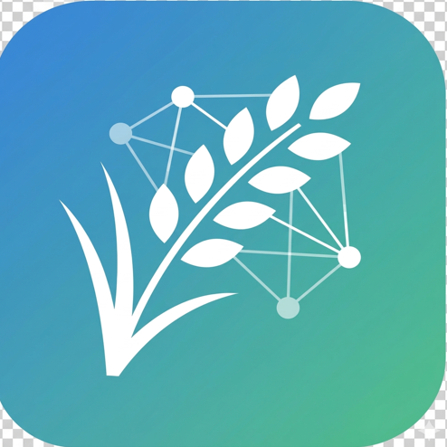
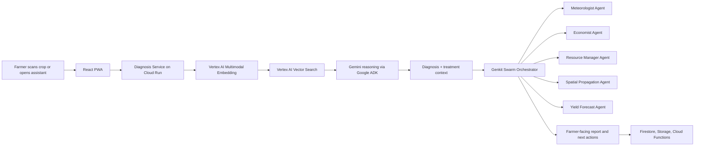
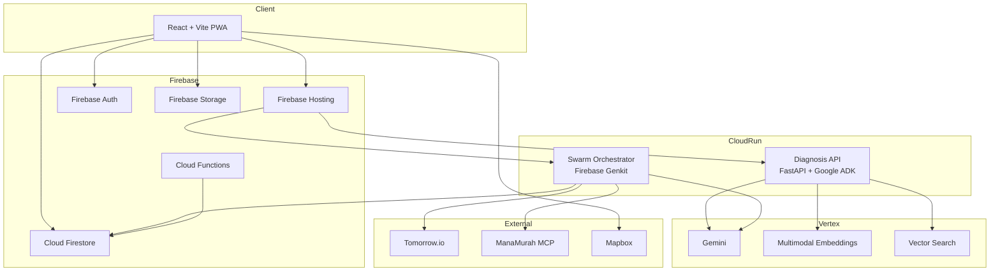

<p align="center">
  
</p>

# AcreZen / PadiGuard AI

An offline-friendly AI field assistant for Malaysian padi farmers that moves from chat to action: detect crop disease from a photo, ground the result with retrieval, and trigger a multi-agent workflow for spray timing, ROI, spread risk, stock checks, and yield planning.

The farmer-facing app is branded as **AcreZen**. The backend services and deployment targets in this repo are named **PadiGuard AI**.

## Why This Matters

Malaysia still depends heavily on food imports, while many smallholder farmers lose yield and income because crop disease is detected too late and farm decisions are made with incomplete data.

AcreZen focuses on one of the country's highest-impact food security problems:

- Late detection of padi disease and pest outbreaks
- Poor visibility into zone-level farm risk
- Inefficient spray timing due to weather uncertainty
- Low confidence in treatment spending and ROI
- Weak coordination between diagnosis, inventory, and action

## What Makes It Different

Instead of stopping at a chatbot answer, AcreZen turns one scan into an autonomous decision workflow:

- **Real-time crop diagnosis** using Vertex AI multimodal embeddings, Vector Search, and Gemini reasoning
- **Autonomous multi-agent analysis** using Firebase Genkit to produce weather, economic, inventory, spatial, and yield decisions in one flow
- **Map-based farm zoning** so disease is tied to specific field areas, not generic farm-level advice
- **Actionable treatment planning** with ROI, stock awareness, and spray-window guidance
- **Field-ready UX** with PWA support, offline persistence, and mobile-first scanning

## Problem

Smallholder padi farmers often know there is a problem only after yield damage is already visible. Even when disease is detected, the next steps are fragmented:

- One tool identifies the disease
- Another app gives weather
- Another source gives market price
- Inventory is tracked manually
- No system connects diagnosis to economic and operational action

That fragmentation causes wasted chemicals, mistimed spraying, lower yields, and avoidable cost.

## Solution

AcreZen is an AI decision layer for padi operations.

Farmers scan a leaf, assign the issue to a mapped farm zone, and receive a grounded diagnosis. That diagnosis can then trigger a multi-step agent workflow that answers:

- Is it safe to spray now?
- Which nearby zones are likely at risk next?
- Do I have enough stock to execute treatment?
- Is treatment worth the cost?
- What yield loss should I expect if I delay?

This turns the product from a "what is this disease?" tool into a "what should I do next?" system.

## Feature Highlights

- **Autonomous swarm report:** one diagnosis fans out into meteorologist, economist, resource, spatial, and yield agents
- **Photo diagnosis with grounded retrieval:** scan pipeline uses Vertex AI embeddings plus Vector Search before Gemini reasoning
- **AI assistant with memory:** the chat assistant can answer from real scan history and uploaded captures
- **Weather-aware spray advisory:** timing recommendations account for rain risk and safe spray windows
- **Treatment ROI engine:** combines treatment cost, expected gain, inventory context, and farm-gate pricing logic
- **Spread-risk visualization:** infected zones can generate spatial spread overlays and at-risk neighboring areas
- **Inventory and alerts:** low-stock situations can trigger FCM-backed notifications
- **PWA workflow:** mobile install, offline persistence, and field-friendly usage

## Autonomous Multi-Agent Analysis

The strongest part of AcreZen is that it does not treat diagnosis as the end of the interaction. It treats diagnosis as the start of an operational workflow.

Once a scan identifies a likely disease and treatment path, the Firebase Genkit swarm orchestrator turns that result into a coordinated, multi-agent decision cycle. Instead of giving the farmer one isolated answer, the system decomposes the problem into the same real decisions a farmer must make in the field:

- **Meteorologist Agent:** checks whether the treatment should happen now or be delayed based on rain probability, spray safety, humidity, wind, and the next clear application window
- **Economist Agent:** converts treatment into business logic by estimating treatment cost, market value, farm-gate value, and ROI so the farmer knows whether the intervention is financially justified
- **Resource Manager Agent:** checks whether the farmer already has enough stock to execute the treatment and can trigger a low-stock alert instead of letting the recommendation fail in real life
- **Spatial Propagation Agent:** estimates how far the disease could spread, which neighboring zones are at risk, and where monitoring or containment should happen next
- **Yield Forecast Agent:** translates the disease severity and treatment context into expected yield impact, helping the farmer understand the cost of delay in production terms, not just disease terms

A farmer does not only ask, "What disease is this?" The real questions are:

- Can I spray today?
- Will the treatment pay back its cost?
- Do I already have the inputs?
- Which field zones need attention next?
- How much yield am I likely to lose if I wait?

AcreZen answers those questions in one connected flow.

That design is what makes the product meaningfully agentic. Each agent owns a distinct reasoning domain, but all of them work from a shared diagnosis context. The final result is not a generic chatbot response. It is a synthesized field decision that combines biological risk, weather timing, stock readiness, spatial spread, and financial outcome.

This is impactful for three reasons:

- **It reduces decision fragmentation.** Farmers do not need to jump between separate tools for diagnosis, weather, cost, inventory, and planning.
- **It improves actionability.** The output is directly closer to execution: spray now or delay, buy stock or use existing stock, monitor adjacent zones, expect this level of yield impact.
- **It raises real-world usefulness.** Many agriculture apps stop at information. AcreZen pushes into autonomous decision support, which is far more valuable for smallholders operating under time, budget, and weather pressure.

This project shows strong AI integration depth because AI is used as the system's operational brain, not as a decorative chat layer. It also demonstrates technical complexity because the project coordinates multiple reasoning paths, mixes deterministic and model-driven logic, and produces a single actionable recommendation from several moving inputs. Most importantly, it demonstrates clear national relevance: better decisions at the field level can mean lower crop loss, better input efficiency, and stronger padi resilience at scale.

## Agentic Workflow



## Architecture Overview



## Build With AI Alignment

This project uses Google AI as core product logic, not as a cosmetic add-on:

- **Gemini:** reasoning for diagnosis validation, assistant replies, and agent summaries
- **Firebase Genkit:** multi-agent orchestration for action-focused decision flows
- **Google ADK:** structured diagnosis pipeline and reasoning workflow
- **Vertex AI:** multimodal embeddings, Vector Search retrieval, and Gemini access
- **Firebase + Cloud Run:** production-ready hosting, auth, storage, persistence, and serverless deployment

Grounding in the current codebase is implemented through **Vertex AI Vector Search + Firestore-backed agricultural metadata and scan history**, which functions as the retrieval layer for diagnosis and recommendations.

## Major Tech Stack

- **Frontend:** React, Vite, React Router, PWA, Mapbox GL
- **Backend:** Python, FastAPI, WebSockets, Node.js Firebase Functions
- **AI stack:** Gemini, Firebase Genkit, Google ADK, Vertex AI Multimodal Embeddings, Vertex AI Vector Search
- **Google Cloud:** Cloud Run, Firebase Hosting, Firebase Auth, Cloud Firestore, Firebase Storage
- **External data/services:** Tomorrow.io weather API, ManaMurah MCP price endpoint

## Repository Structure

```text
frontend/                 React PWA
backend/diagnosis/        FastAPI diagnosis + assistant + ROI APIs
backend/swarm/            Firebase Genkit multi-agent orchestrator
backend/cloud-functions/  Firestore-triggered spread propagation logic
firebase.json             Hosting rewrites to Cloud Run services
```

## Local Setup

### Prerequisites

- Node.js 20+
- Python 3.12+
- A Firebase project
- A Google Cloud project with Vertex AI enabled
- A service account JSON with access to Vertex AI and Firestore
- Optional but recommended: Tomorrow.io API key, ManaMurah MCP endpoint, Mapbox token

### 1. Install dependencies

```bash
npm install
cd frontend && npm install
cd ../backend/cloud-functions && npm install
cd ../..
python3 -m venv .venv
source .venv/bin/activate
pip install -r backend/requirements.txt
```

### 2. Configure backend environment

Create `backend/.env`:

```bash
GCP_PROJECT_ID=your-gcp-project-id
GCP_REGION=us-central1
GOOGLE_APPLICATION_CREDENTIALS=/absolute/path/to/service-account.json
GCS_BUCKET_NAME=your-bucket

VECTOR_SEARCH_INDEX_ENDPOINT=projects/.../locations/.../indexEndpoints/...
VECTOR_SEARCH_DEPLOYED_INDEX_ID=your-deployed-index-id
GEMINI_MODEL_NAME=gemini-2.0-flash

TOMORROW_IO_API_KEY=your-tomorrow-io-key
MCP_SERVER_URL=https://your-mcp-endpoint/sse
GOOGLE_GENAI_API_KEY=optional-direct-gemini-key

FRONTEND_CORS_ORIGINS=http://localhost:5173
```

### 3. Configure frontend environment

Create `frontend/.env`:

```bash
VITE_FIREBASE_API_KEY=your-firebase-api-key
VITE_FIREBASE_AUTH_DOMAIN=your-project.firebaseapp.com
VITE_FIREBASE_PROJECT_ID=your-project-id
VITE_FIREBASE_STORAGE_BUCKET=your-project.appspot.com
VITE_FIREBASE_MESSAGING_SENDER_ID=your-sender-id
VITE_FIREBASE_APP_ID=your-app-id

VITE_MAPBOX_TOKEN=your-mapbox-token
VITE_DIAGNOSIS_API_URL=http://127.0.0.1:8000
VITE_SWARM_API_URL=http://localhost:3400
```

### 4. Run the full app locally

```bash
cd frontend
npm run dev:full
```

This starts:

- Vite frontend
- Diagnosis backend on `:8000`
- Swarm backend on `:3400`

Open `http://localhost:5173`.

## Production Deployment

The production routing in this repo is already structured for:

- **Firebase Hosting** for the web app
- **Cloud Run** for `padiguard-diagnosis`
- **Cloud Run** for `padiguard-swarm`
- **Firebase Functions** for Firestore-triggered spatial spread updates

`firebase.json` rewrites:

- `/api/**` to the diagnosis service
- `/api/actions` and `/api/runAction` to the swarm service
- `/**` to the SPA frontend

## Impact

### Farmer impact

- Earlier disease detection before large-scale spread
- Better timing for spraying, especially in rain-sensitive windows
- Lower waste from unnecessary or mistimed chemical use
- Clearer treatment economics for cash-constrained farmers
- Better operational awareness across mapped farm zones

### National relevance

- Supports Malaysia's food security agenda through stronger padi productivity
- Helps smallholders become more resilient to climate, disease, and supply volatility
- Encourages local AI creation around agriculture, not just AI consumption

### Environmental impact

- More targeted treatment reduces blanket spraying
- Zone-level actions can reduce excess input use
- Better timing may improve efficacy per application

## Business Model

AcreZen is designed as a practical agri-intelligence platform, not just a hackathon demo.

### Target customers

- Small and mid-sized padi farmers
- Farmer cooperatives
- Agro-input distributors
- Government and NGO agricultural extension programs
- Plantation or contract-farming coordinators

### Revenue model

- **Freemium farmer app:** basic scan, weather, and chat free; advanced reports and forecasting paid
- **B2B dashboard layer:** cooperatives and distributors pay for multi-farm monitoring and aggregated risk insights
- **Input marketplace/referral fees:** treatment recommendations can connect to participating suppliers
- **Institutional licensing:** white-label or district-level deployment for extension officers and agri agencies

### Why it can scale

- Cloud Run architecture supports multi-tenant deployment
- Agent workflows let new services be added without rebuilding the product from scratch
- The same foundation can expand from padi to other Malaysian crops

## AI-Generated Code Disclosure

This project includes **AI-assisted development**.AI coding tools were used to accelerate implementation, prototyping, refactoring, and documentation. All AI-generated or AI-assisted code was reviewed, edited, and integrated by the team, and the team is responsible for understanding and defending the full codebase during judging.

## Demo Flow

1. Sign in and create a farm profile.
2. Draw farm grids on the map.
3. Capture or upload a crop image.
4. Receive grounded diagnosis and treatment context.
5. Open the swarm report for weather, ROI, spread risk, stock, and yield analysis.
6. Act on the recommendation inside the same workflow.

## Current Status

Implemented in this repo:

- Farmer mobile/web app
- Real-time diagnosis backend
- Assistant chat flow
- Multi-agent swarm orchestration
- Weather, ROI, inventory, and yield workflows
- Firestore-backed map and report persistence
- Cloud Run/Firebase deployment wiring

Planned next extensions:

- Broader agricultural datasets and national-scale retrieval sources
- More automated intervention triggers
- Cooperative-level analytics dashboards
- Multilingual farmer experience improvements
